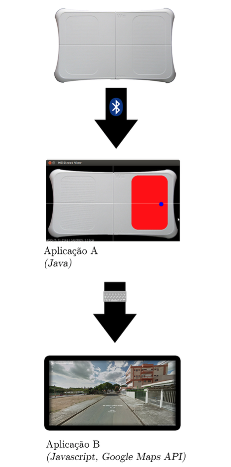
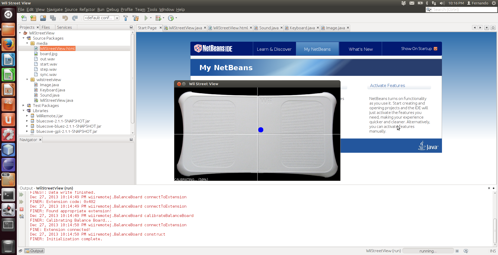
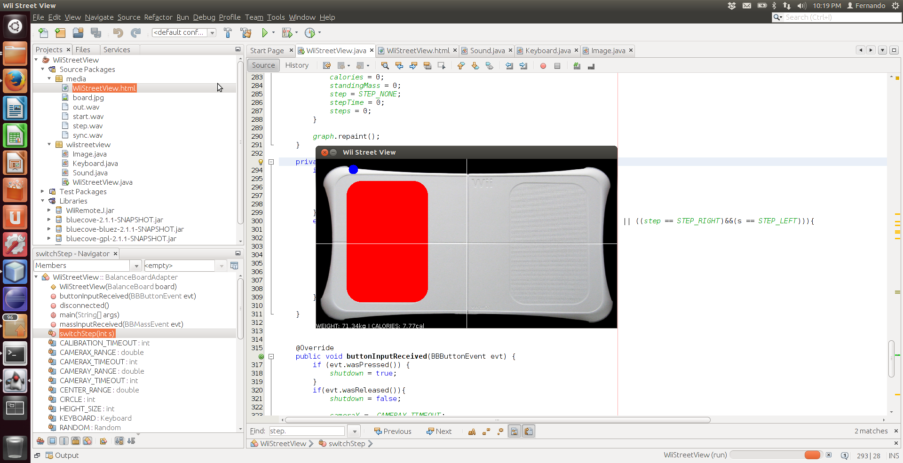
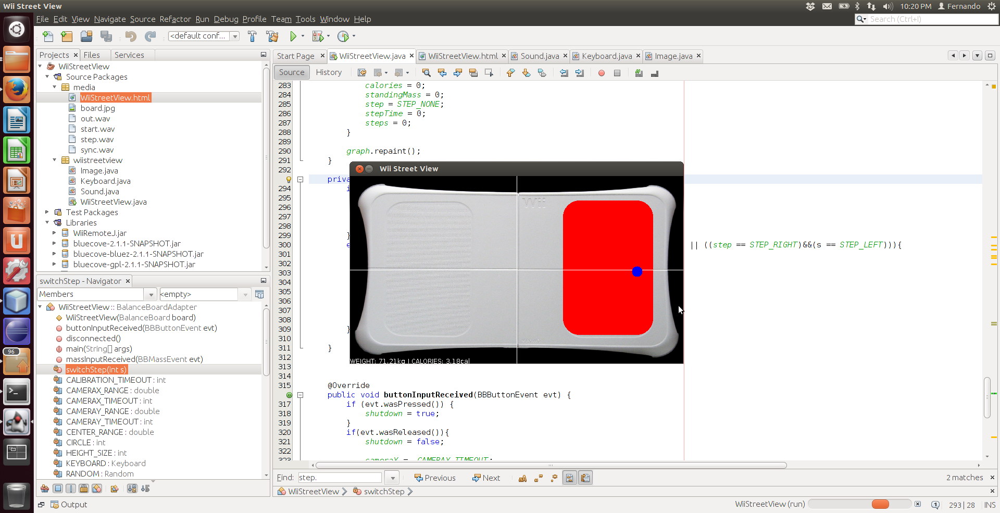
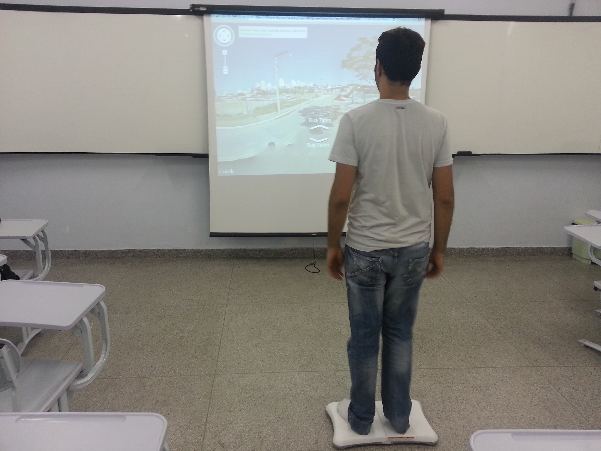
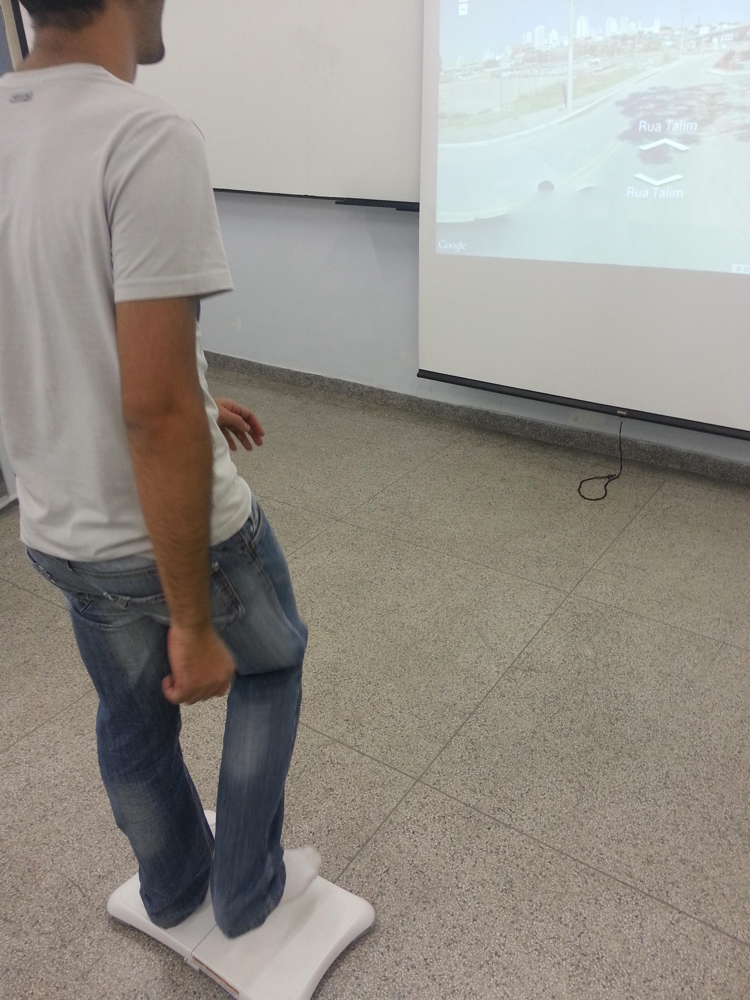

# Wii Street View 
## Simulação de um Ambiente de Caminhada com Realidade Virtual
  
### Realidade Virtual e Aumentada

- **Autor:** Luiz Fernando Machado Silva
- **Orientador:** Prof. Dr. Ezequiel Roberto Zorzal
- **Ano:** 2013
- **Curso:** Bacharelado em Ciência da Computação
- **Instituição:**  Instituto de Ciência de Tecnologia (ICT) da Universidade Federal de São Paulo (UNIFESP)   
  
**Resumo:** *Este trabalho propõe o desenvolvimento de um aplicativo que simule, de forma natural o possível, uma caminhada em um ambiente virtual baseado em ruas do mundo real, com o auxílio de Realidade Virtual.*

**Palavras-chave:** *“realidade virtual”, “Wii Balance Board”, “Google Street View”, “fitness game”, exergaming*

### Simulation of a Jogging Environment using Virtual Reality

**Abstract:** *This work proposes the development of an application able to simulate, in the most natural way, jogging on a virtual environment based on real-life streets, using Virtual Reality.*

**Keywords:** *“virtual reality”, “Wii Balance Board”, “Google Street View”, “fitness game”, exergaming*

## 1.	INTRODUÇÃO
Desde o final dos anos 80, desenvolvedores de videogames tem mostrado interesse em aplicar tecnologias de reconhecimento de movimentos corporais para criar jogos capazes de oferecer uma forma de interação mais ativa com os jogadores. <Howard Rheingold. "Virtual Reality" pp188-189 Simon & Schuster. 1991. ISBN 0-671-77897-8.>

A partir dessas novas formas de interação, os desenvolvedores começaram a realizar seus primeiros experimentos com os “exergames” – jogos que, por definição, oferecem alguma forma de exercício físico. <Jeff Sinclair, Philip Hingston, and Martin Masek. 2007. Considerations for the design of exergames. In Proceedings of the 5th international conference on Computer graphics and interactive techniques in Australia and Southeast Asia (GRAPHITE '07). ACM, New York, NY, USA, 289-295.>

Na última década, acompanhando os avanços da tecnologia, consoles de domésticos receberam uma série de acessórios que permitem novas formas de interação ativa com os usuários – dentre os quais podemos destacar o Wii Balance Board. <<http://www.techtudo.com.br/jogos/noticia/2011/11/top-10-jogos-para-se-entrar-em-forma.html>>

Segundo a fabricante, O Wii Balance Board é um periférico do console de videogame doméstico Wii, desenvolvido pela Nintendo Company, Limited., empresa japonesa fabricante de hardware e software para videogames. O periférico, que tem o formato de uma balança retangular doméstica, usa quatro sensores de pressão dispostos em suas extremidades para determinar o centro de equilíbrio do usuário e também seu peso distribuído. <Clark, R. , Bryant, A. , Pua, Y. , McCrory, P. , Bennell, K. , et al. (2010). Validity and reliability of the nintendo wii balance board for assessment of standing balance. Gait & Posture, 31(3), 307-310.> <<http://www.nintendo.com/consumer/downloads/wiiBalanceBoard.pdf>>

## 2.	OBJETIVO
O objetivo desse trabalho é propor a implementação de uma aplicação capaz de interpretar dados de centro de equilíbrio e distribuição de peso, extraídos em tempo real do acessório Wii Balance Board, para simular uma caminhada pelas ruas virtuais disponíveis online no Google Street View.

Segundo o desenvolvedor, o Google Street View é uma tecnologia criada pela Google Inc., empresa norte-americana de serviços online e de software, usada para exibir imagens panorâmicas, em 360 graus, de ruas, pontos turísticos e outras localidades ao redor do mundo. A navegação pelos mapas é realizada através do uso de mouse e teclado. <<https://www.google.com/maps/views/streetview?hl=pt-BR&gl=br>>
	

## 3.	MATERIAIS E MÉTODOS
A implementação da aplicação contou com duas frentes distintas – uma responsável por conectar-se ao acessório Wii Balance Board e converter os dados de peso obtidos em sinais interpretáveis e a outra, responsável pela navegação no ambiente virtual do Google Street View. Veja o fluxograma.
 

## 4.	IMAGENS

*Calibrando Wii Balance Board ao inicializar o simulador.*

*Wii Balance Board detectando peso no pé esquerdo.*

*Wii Balance Board detectando peso no pé direito.*

*fotografia do simulador em uso.*

*fotografia do simulador em uso.*

 
 ## 5.	LICENÇA
2013 [MIT License](LICENSE).
